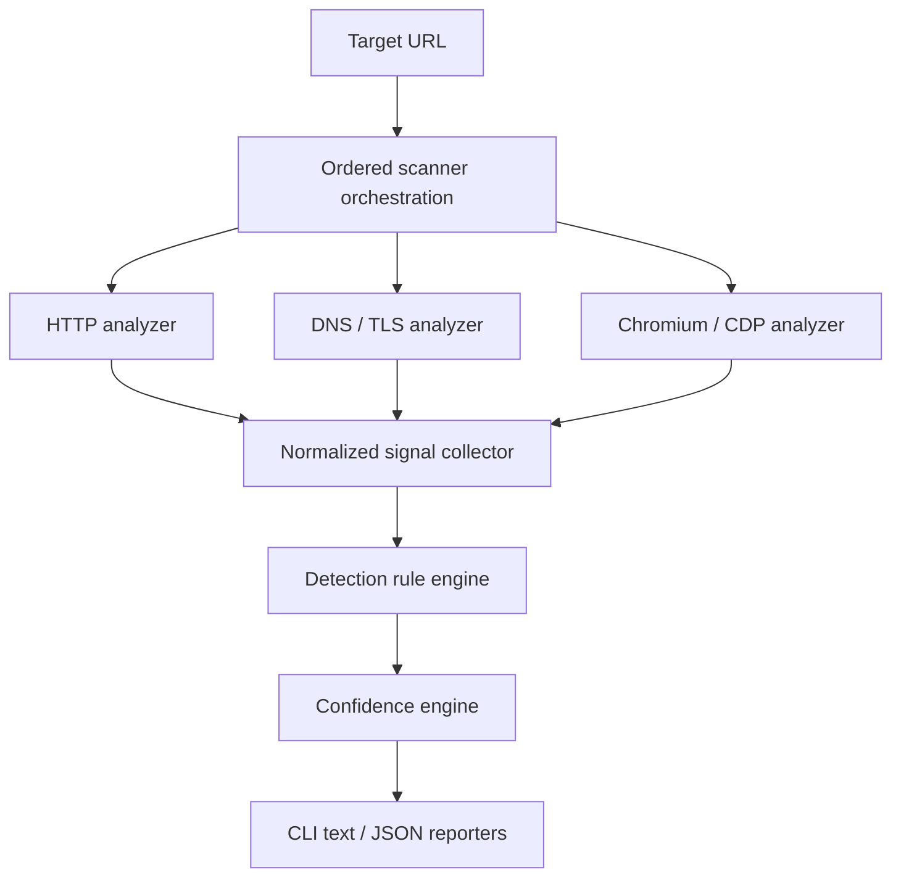

# Architecture

## Overview

Hemera separates observation from detection. Protocol- and browser-specific
analyzers collect facts, normalize them as signals, and pass them to a rule
engine. The scoring layer then evaluates the matched, missing, ambiguous, and
conflicting evidence before reporters render the result.



## Components

### URL validation

Validation is a mandatory boundary before every request and after every redirect.
It should accept only HTTP/HTTPS, resolve hosts under controlled rules, reject
loopback/private/link-local/metadata targets, and enforce redirect, response-size,
and time limits. See [Security and ethical boundaries](security-and-ethics.md).

The implemented `internal/networkguard` package validates absolute HTTP/HTTPS
URLs, resolves names through an injectable resolver, rejects mixed public and
forbidden DNS answers, and composes the validated IP with the requested port for
an injectable dialer. The HTTP transport therefore cannot silently resolve a
different address. When DNS returns several public addresses, the dial path tries
them in resolver order under the same context. Resolution and policy checks occur
during initial validation, before each redirect, and again for every new
connection. TLS continues to use the original hostname for SNI and certificate
validation. The analyzer owns the TLS configuration, enforces TLS 1.2 or later,
and accepts only an optional root CA pool for deterministic trust customization;
callers cannot disable certificate verification.

Destination classification uses generated Go data derived from checked-in
snapshots of the IANA IPv4 and IPv6 Special-Purpose Address Registries. After
normalizing IPv4-mapped IPv6 addresses to IPv4, the runtime rejects every
matching listed prefix, even entries marked globally reachable, then applies
separately declared Hemera exclusions and Go's global-unicast classification as
final conservative checks. Generation and refresh are development-time
operations; scan execution has no registry lookup or dependency on IANA.

### HTTP analyzer

The low-cost first pass collects status codes, redirect chains, response headers,
cookies, initial HTML, statically visible scripts and iframes, and third-party
hostnames.

This pass is implemented in `internal/httpanalyzer`. It performs one GET
navigation, ignores environment proxies, and does not fetch subresources. The
complete operation is limited to 15 seconds; connection, TLS handshake, and
response-header waits are each limited to 5 seconds. It permits at most 10
redirects, 1 MiB of response headers, and 2 MiB of decompressed body data.
These are hard ceilings: configuration may lower but cannot raise them. The
User-Agent is limited to 512 bytes, the transport permits one active connection
per host, and static extraction stops after 4096 unique script or iframe URLs.
Intermediate and final HTTP responses produce normalized signals.

The analyzer's `Observe` boundary converts its navigation result into the common
observation envelope. Navigation diagnostics are retained as typed HTTP metadata
while only normalized signals enter rule matching and scoring.

Only the final body is analyzed as HTML. Charset decoding and two streaming
HTML5 tokenizer passes from `golang.org/x/net` first select the first valid
HTTP(S) `<base href>`, then extract scripts and iframes in document order. The
analyzer does not build a DOM tree. Decoding and both passes observe the scan
context. Cancellation and deadlines remain fatal; non-security HTML decoding or
tokenization errors become warnings without discarding HTTP signals.

The analyzer records cookie names without values and redacts sensitive response
headers. Stored and displayed URL observations mask query values. A body prefix
at the size limit remains analyzable and is reported as truncated. Unsupported
HTML charsets and parser failures become warnings without discarding HTTP
signals; connection, TLS, timeout, header, and body-read failures remain fatal.

### DNS / TLS analyzer

`internal/dnstls` runs after the HTTP analyzer and emits normalized
`dns_record` and `tls_property` signals under the stable `dns_tls_analyzer`
source. It performs one cancellable CNAME lookup, limited to two seconds, for the
final HTTP host. A `cname` signal is emitted only when the canonical target
differs from that host. Go's resolver exposes the final canonical name rather
than every intermediate alias, so intermediate CNAME hops are not collected.

For HTTPS, the HTTP analyzer copies a bounded scalar snapshot from the verified
final `resp.TLS` state into typed HTTP metadata. The DNS/TLS analyzer turns that
snapshot into signals in this fixed order: TLS version, negotiated ALPN when
present, leaf certificate issuer, leaf certificate subject, and sorted unique
DNS SANs. DNS signals precede TLS signals. At most 256 DNS SANs are retained;
SANs with whitespace, control characters, or invalid DNS label syntax are
omitted rather than rewritten. Other certificate text values containing control
characters or exceeding 2,048 bytes are also omitted. IP addresses, non-DNS
SANs, certificate bodies, ASN hints, and provider enrichment are not collected.

This boundary deliberately performs no TLS dial or handshake. It reuses the
HTTP connection state, so the default scan still makes only the connections
required for HTTP navigation. A CNAME failure is non-fatal: already derived TLS
signals remain as a partial observation and scanner cancellation remains fatal.
DNS and TLS signals are supporting evidence and must not independently prove
that a precise bot-management or WAF product is active.

### Browser analyzer

A sandboxed Chromium instance observed through the Chrome DevTools Protocol can
collect the final DOM, network requests and responses, XHR/fetch traffic, dynamic
scripts and iframes, JavaScript-created cookies, browser redirects, visible
challenges, and a small set of relevant JavaScript globals. Navigation remains
normal: the analyzer must not implement bypass behavior.

The browser bootstrap in `internal/browser` starts a locally installed Chromium
through `chromedp`, creates a fresh temporary profile, binds the random CDP port
to `127.0.0.1`, and verifies the connection with `Browser.getVersion`. Startup
is limited to a positive configurable timeout with a hard ceiling of 10 seconds.
Session shutdown is idempotent, bounded, tied to the caller's context, and
removes the temporary profile after the process stops. The package deliberately
overrides `chromedp`'s root behavior so Chromium is never launched with
`--no-sandbox`. It also verifies Chromium's effective command line and rejects
sandbox-disabling switches added by a launcher. Startup requires the exact
Hemera loopback proxy, loopback-bypass exclusion, direct-DNS suppression, QUIC
disable, and non-proxied WebRTC UDP restriction. Missing, duplicate, or
conflicting security switches are fatal; environments that cannot prove these
invariants fail startup.

`Session.BeginCapture` now permits one recorder for the current target. It
enables the CDP Network and Page domains and records requests, responses, and
redirect responses in CDP order. Finalization stops the listener, reads target
metadata, and runs a Hemera-owned serializer in an isolated JavaScript world.
The serializer walks at most 100,000 DOM nodes and attributes, appends at most
2 MiB while walking instead of materializing an unbounded outer HTML string,
and collects bounded `script[src]` and `iframe[src]` URLs in document order. It
does not invoke JavaScript supplied by the page. Finalization also reads only
cookie names and domains from the isolated profile. Values are overwritten
before the minimized cookie object is constructed. Malformed domains are
omitted; cookies are sorted and deduplicated by name and domain so first- and
third-party observations with the same name remain distinguishable.
The raw result retains no headers, bodies, POST data, timestamps, CDP IDs, remote
addresses, or cookie values. HTTP(S) URLs have credentials and fragments removed
and query strings replaced with `?redacted`; non-web URLs are omitted.

Capture storage is fixed at 2 MiB of serialized final DOM, 100,000 DOM traversal
work items, 4096 entries for each traffic or resource collection, and 8192 bytes
per URL. Generic, deduplicated warnings mark truncation without embedding
page-controlled data. Results are cloned at the recorder boundary. No unbounded
serialized DOM is constructed in Chromium or Go, and the bounded internal
observation is not sent directly to reporters.

`Session.Navigate` accepts one absolute
HTTP(S) target and permits only one navigation at a time. The complete operation,
including initial DNS validation, is bounded by 15 seconds. Chromium is forced
through a random per-session proxy listening only on `127.0.0.1`; direct host
resolution is disabled and QUIC is unavailable, so HTTP, HTTPS CONNECT tunnels,
redirects, and subresource connections cannot bypass the proxy. The proxy uses
`internal/networkguard` to resolve every destination and dials the validated IP
while preserving the original hostname for HTTP and end-to-end TLS. Initial
validation and connection-time resolution are separate, so a rebinding answer
is rejected before the connection is opened.

Non-proxied WebRTC UDP is disabled as an additional direct-network boundary.
WebSocket transports are rejected rather than allowed to escape HTTP(S) request
accounting.
CDP Fetch interception authorizes HTTP(S) requests before they leave Chromium
and enforces a default limit of 256, with a hard ceiling of 4096. Redirects are
limited to 10. CDP request lifecycle tracking permits 16 active requests by
default, configurable only up to 32. This accounting is independent of proxy
connections, so requests multiplexed inside one HTTPS CONNECT tunnel each
consume a slot. The proxy applies a 5-second connection timeout. Directly
forwarded HTTP responses also have a 5-second response-header timeout.
Each navigation has independent 16 MiB ceilings for proxy transfer and decoded
response data; `Network.dataReceived` accounts for decompressed bytes that an
encrypted tunnel cannot inspect. Proxy transfer accounting includes request and
response headers, request bodies, and tunnel bytes. Individual proxy headers are
bounded to 1 MiB and every browser URL to 8192 bytes. Limit
failure cancels navigation, closes active proxy work, stops page loading, and
preserves a typed error for the caller. Downloads are denied, cache reuse and
service workers are bypassed, and the proxy is inactive outside an authorized
navigation.

After the load event, navigation remains active for a bounded observation phase.
The default phase ends after 250 ms with no meaningful HTTP(S) activity and no
active request, or unconditionally after 1.5 seconds. Configuration may lower
these durations but cannot exceed one second of idle time or three seconds of
post-load time. Requests, completions, failures, and decoded-byte events reset
the quiet timer. Caller cancellation remains immediate. The proxy, Fetch and
Network domains, request lifecycle tracking, and every request, redirect,
transfer, decoded-byte, and concurrency budget remain active through this phase;
continuous traffic and long polling stop at the hard deadline.

Milestone 1 fails closed on execution targets that would need independent CDP
policy attachment. Dedicated/shared workers and service workers are
auto-attached paused and closed before their code runs. Their script requests
still traverse the validated proxy and consume ordinary request, concurrency,
and byte budgets. Popup creation fails the navigation on `Page.windowOpen`
before child loading. WebSockets remain rejected, and downloads are denied
without writing a file.

The tagged integration test loads a versioned, entirely synthetic corpus from
`internal/browser/testdata`. Its test-only manifest declares the sole synthetic
host, every route and resource, capture completion selectors, ordered traffic,
DOM markers, scripts, iframes, cookie names, and forbidden metadata. A loader
rejects path traversal, duplicate or missing routes, oversized assets, absolute
or protocol-relative HTTP(S) references, and undeclared redirect destinations
without starting Chromium. The server accepts only declared GET requests for
`fixture.test`.

Each capture scenario receives a fresh browser session and profile. Dynamic
scenarios rely only on production post-load quiet/deadline semantics before
capture finalization; tests do not call a completion-selector wait. A delayed
fixture schedules fetch, cookie, script, and DOM work after `load`. Negative and
adversarial cases cover quiet pages, continuous traffic, request/concurrency/byte
limits, private and rebinding destinations, redirect loops, credential
redirects, malformed and oversized URLs, compressed bodies, recursive iframes,
workers, popups, WebSockets, downloads, and post-load DOM growth. Injected
resolver and dialer dependencies make the synthetic hostname validate as a permitted
public destination while connecting the production proxy to loopback
`httptest`. This exercises validation and pinning without weakening the global
destination policy or contacting public DNS or a third party.

The normalized browser adapter starts a fresh session, begins capture before
navigation, finishes capture after the bounded navigation completes, and closes
the session deterministically. It emits `network_request`, `network_response`,
`page_content`, `script_url`, `iframe_url`, and `cookie` signals under
`browser_analyzer`. Exact duplicates are removed and signals are sorted by
channel and normalized fields before scanner aggregation. Cookie signals use
the name as key and validated domain as value; cookie values never enter the
signal model. The raw DOM and cookie provenance never enter reporters; page
content can only influence rule matching, and a selected page-content evidence
value is omitted from reports.

The CLI configures HTTP as fatal and DNS/TLS plus browser observation as
non-fatal. An unsafe initial HTTP target therefore stops the pipeline before
Chromium starts. Browser startup, navigation, capture, or cleanup failures
retain safe partial signals where available and otherwise produce a failed
coverage entry. The scanner validates all three observations, aggregates their
signals in configured order, and invokes the analyzer-independent scoring engine
once. For a negative rule result, the scanner derives mandatory signal sources
from exact `source` predicates and dependencies. A partial, failed, or absent
mandatory source produces `insufficient_coverage` in report V4 instead of a
definitive `not_detected`; rules never import or name a Go analyzer type.

### Signal model

Every analyzer emits the common model implemented in `pkg/model`:

```go
type Signal struct {
	Type       SignalType `json:"type"`
	Source     string     `json:"source"`
	Key        string     `json:"key"`
	Value      string     `json:"value"`
	URL        string     `json:"url,omitempty"`
	Confidence float64    `json:"confidence"`
}
```

Signal types include response headers, cookies, script URLs, network
requests/responses, DOM selectors, iframe URLs, JavaScript globals, DNS records,
TLS properties, redirects, page content, and statically referenced third-party
resource hosts. A `resource_host` signal means that HTML referenced a host; it
does not mean Hemera contacted that host.

`Type`, `Source`, and `Key` are required. `Confidence` is finite and bounded
between 0 and 1; it represents certainty in the observation, not the final
confidence of a product detection. `URL` is optional because some observations
are not URL-scoped. The model exposes `Validate` so producers can enforce these
shared invariants before signals enter the detection pipeline.

The rule engine must depend on this model, not directly on Chromium or
`net/http`. This boundary enables deterministic fixture tests without live scans.

`internal/analysis` wraps signals in a small typed observation contract:

```go
type Observation struct {
    Source   string
    Signals  []model.Signal
    Warnings []string
    Metadata Metadata
}
```

`Metadata` currently has an optional `HTTPMetadata` member for the requested and
final URLs, status, redirects, body-truncation state, and a bounded TLS snapshot
from the verified final connection. This information is diagnostic and does not
become detector evidence unless the DNS/TLS analyzer separately emits an
appropriate normalized signal. Future source-specific metadata must add a
bounded typed member; opaque `map[string]any` payloads are not part of the
contract.

### Detection rules

Rules are data-driven through the strict, versioned JSON schema implemented in
`internal/rules` and documented in
[Detector rule schema V2](detector-rules.md). The schema expresses:

- positive and negative signals;
- `AND` and `OR` combinations;
- correlation groups, minimum independent evidence, and weighted signals;
- ambiguity penalties and product conflicts;
- dependencies between related vendor and product detections.

Conditions form bounded `all` and `any` trees over normalized signal fields.
Text predicates support exact, contains, prefix, suffix, and RE2 regular
expression operations. Documents and references are validated before matching;
matching retains positive, missing, negative, and ambiguous evidence in stable
rule and predicate order. A vendor-level result never automatically implies a
product-level result.

`internal/detectors` embeds the validated V2 rules shipped with the binary.
Milestone 0 includes product-specific rules for Cloudflare Turnstile and Google
reCAPTCHA. They use documented client-script URLs as decisive evidence and
static HTML markers only as supporting evidence. Related static observations
share one `static_integration` group so their maximum, not their sum, contributes
to confidence.

### Confidence engine

The V2 model is deliberately simple and is implemented in `internal/scoring`:

```text
raw evidence = weight × observation confidence
group contribution = maximum raw evidence in that group
score = sum(positive group contributions)
      - conflicting evidence
      - ambiguity penalty
```

The bounded 0–100 result should be labeled consistently:

| Score | Level | Meaning |
| --- | --- | --- |
| 90–100 | Very High | Strong evidence from complementary groups |
| 75–89 | High | Strong product-specific evidence |
| 50–74 | Medium | Meaningful evidence with real ambiguity |
| 25–49 | Low | Weak signals; do not present as certain |
| 0–24 | Not detected | Insufficient evidence |

Each evidence contribution is multiplied by the producing signal's observation
confidence. Positive evidence is aggregated by an explicit rule-local group;
omitting the group makes that predicate independent. Only the maximum effective
contribution in a group is counted, while every raw match remains explainable.
`minimum_evidence` counts distinct matched groups. Negative and ambiguous
evidence and fixed directional conflicts are subtracted after positive grouping.
Dependencies are acyclic and must be detected; a missing dependency blocks
detection while the pre-dependency evidence score remains available for
explanation. Scores are clamped to 0–100.

The scoring layer owns the raw and effective contribution assigned to every
matched predicate and group. Reporters receive those values as scored evidence;
they sanitize and format them but never recalculate weights, grouping, or gates.

Signal confidence and detection confidence have different meanings. Signal
confidence expresses certainty in an observation; the final 0–100 score
expresses rule-evidence strength after correlation, penalties, and dependencies.
The final score is a confidence indicator, not a calibrated probability.

Rule schema V1 remains readable with its original additive positive scoring;
correlation groups and distinct-group minimum evidence require V2. Bayesian
scoring, calibration on a labeled corpus, or learned weights can be considered
later; none is part of V2.

### Scan orchestration and reporting

`internal/scanner` is the thin application boundary that runs an ordered list of
analyzers. Each analyzer has a stable unique source and returns an
`analysis.Observation`. Every signal in that observation must carry the same
source; an analyzer cannot attribute evidence to another source. The scanner runs
analyzers sequentially in configuration order, validates every `model.Signal`,
appends signals without sorting or blind deduplication, and invokes scoring once
with the aggregate slice. Analyzer order, signal order within each observation,
outcomes, and report coverage are therefore deterministic. The aggregate result
retains the original target independently of HTTP metadata so partial scans can
still produce a sanitized target field.

Each configured analyzer has one explicit failure policy:

- `abort` stops the scan and returns the analyzer error. The current HTTP analyzer
  uses this policy, so invalid targets and navigation failures retain the existing
  CLI failure behavior and no later analyzer runs.
- `continue` retains valid partial signals and typed metadata, records the
  analyzer as `partial`, and runs later analyzers. If no signal or typed metadata
  was produced, the outcome is `failed`. Both outcomes remain visible in reports.

Caller cancellation is always fatal, including for an analyzer configured to
continue. Invalid signals, observation or signal source mismatches, and duplicate
typed metadata kinds are analyzer contract violations and are also always fatal.
Successful observations may contain analyzer-local warnings without becoming
partial. The scanner retains local errors for internal diagnostics, but reporters
omit their text because it may contain untrusted input.

Before each analyzer runs, the scanner supplies cloned observations from earlier
analyzers in `analysis.Target.Prior`. This preserves configured ordering and lets
later analyzers reuse bounded typed metadata without implementation-specific
dependencies or mutable aliasing. The current CLI configures HTTP first with
`abort`, then DNS/TLS and browser observation with `continue`.

`internal/report` converts scanner results into a secret-minimized report model.
The CLI renders that model as human-oriented text by default or as versioned,
deterministic JSON with `--format json`. Both formats explain detected and
non-detected rules, including raw positive evidence, its correlation group, the
selected maximum contribution, and later penalties. JSON V4 also records each
analyzer's source, coverage status, and producer-sanitized warnings. They omit
HTML, header/cookie values, and analyzer error details and sanitize every emitted
URL. The JSON schema is experimental until the first stable release; breaking
pre-release changes still require a documented schema-version increment. The
contract and text-output expectations are documented in
[JSON report schema V4](report-schema.md). An exportable local HTML report
remains a later goal.

## Proposed repository layout

```text
cmd/hemera/               CLI entry point
internal/scanner/         scan orchestration
internal/analysis/        shared observations and typed analyzer metadata
internal/detectors/       embedded detector rules
internal/httpanalyzer/    HTTP collection
internal/browser/         Chromium navigation, capture, and signal normalization
internal/dnstls/          DNS/TLS normalization and bounded CNAME observation
internal/signals/         normalization
internal/rules/           rule loading and matching
internal/scoring/         confidence calculation
internal/report/          safe text and JSON renderers
pkg/model/                intentionally public models, if needed
detectors/                data-driven signatures
testdata/                 fixtures, captures, and expected results
docs/                     project and contributor documentation
```

This is a starting boundary map, not a requirement to create empty packages.
Packages should be introduced as working vertical slices need them.
