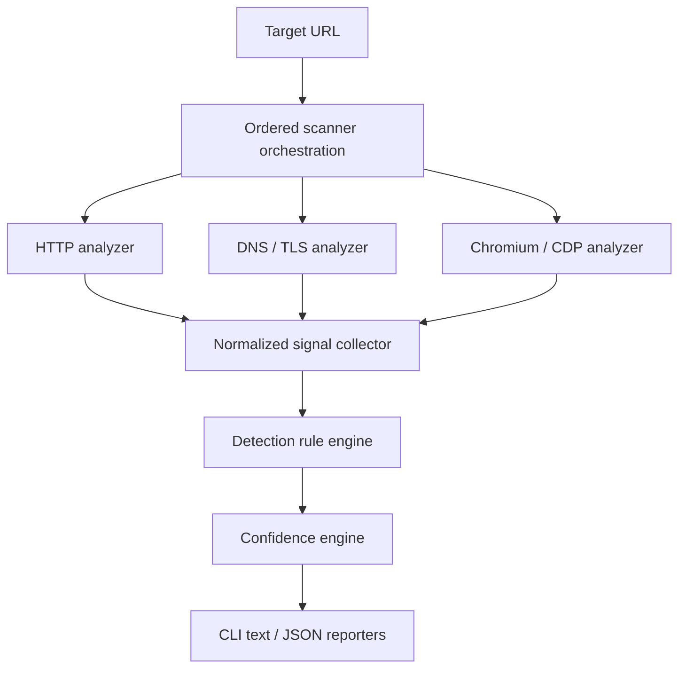

# Architecture

## Overview

Hemera separates observation from detection. Protocol- and browser-specific
analyzers collect facts, normalize them as signals, and pass them to a rule
engine. The scoring layer then evaluates the matched, missing, ambiguous, and
conflicting evidence before reporters render the result.



## Components

### URL validation

Validation is a mandatory boundary before every request and after every redirect.
It should accept only HTTP/HTTPS, resolve hosts under controlled rules, reject
loopback/private/link-local/metadata targets, and enforce redirect, response-size,
and time limits. See [Security and ethical boundaries](security-and-ethics.md).

The implemented `internal/networkguard` package validates absolute HTTP/HTTPS
URLs, resolves names through an injectable resolver, rejects mixed public and
forbidden DNS answers, and composes the validated IP with the requested port for
an injectable dialer. The HTTP transport therefore cannot silently resolve a
different address. When DNS returns several public addresses, the dial path tries
them in resolver order under the same context. Resolution and policy checks occur
during initial validation, before each redirect, and again for every new
connection. TLS continues to use the original hostname for SNI and certificate
validation. The analyzer owns the TLS configuration, enforces TLS 1.2 or later,
and accepts only an optional root CA pool for deterministic trust customization;
callers cannot disable certificate verification.

Destination classification uses generated Go data derived from checked-in
snapshots of the IANA IPv4 and IPv6 Special-Purpose Address Registries. After
normalizing IPv4-mapped IPv6 addresses to IPv4, the runtime rejects every
matching listed prefix, even entries marked globally reachable, then applies
separately declared Hemera exclusions and Go's global-unicast classification as
final conservative checks. Generation and refresh are development-time
operations; scan execution has no registry lookup or dependency on IANA.

### HTTP analyzer

The low-cost first pass collects status codes, redirect chains, response headers,
cookies, initial HTML, statically visible scripts and iframes, and third-party
hostnames.

This pass is implemented in `internal/httpanalyzer`. It performs one GET
navigation, ignores environment proxies, and does not fetch subresources. The
complete operation is limited to 15 seconds; connection, TLS handshake, and
response-header waits are each limited to 5 seconds. It permits at most 10
redirects, 1 MiB of response headers, and 2 MiB of decompressed body data.
These are hard ceilings: configuration may lower but cannot raise them. The
User-Agent is limited to 512 bytes, the transport permits one active connection
per host, and static extraction stops after 4096 unique script or iframe URLs.
Intermediate and final HTTP responses produce normalized signals.

The analyzer's `Observe` boundary converts its navigation result into the common
observation envelope. Navigation diagnostics are retained as typed HTTP metadata
while only normalized signals enter rule matching and scoring.

Only the final body is analyzed as HTML. Charset decoding and two streaming
HTML5 tokenizer passes from `golang.org/x/net` first select the first valid
HTTP(S) `<base href>`, then extract scripts and iframes in document order. The
analyzer does not build a DOM tree. Decoding and both passes observe the scan
context. Cancellation and deadlines remain fatal; non-security HTML decoding or
tokenization errors become warnings without discarding HTTP signals.

The analyzer records cookie names without values and redacts sensitive response
headers. Stored and displayed URL observations mask query values. A body prefix
at the size limit remains analyzable and is reported as truncated. Unsupported
HTML charsets and parser failures become warnings without discarding HTTP
signals; connection, TLS, timeout, header, and body-read failures remain fatal.

### DNS / TLS analyzer

This analyzer may collect CNAME records, relevant provider or ASN hints, and TLS
certificate properties such as issuer and SANs. These are generally supporting
signals and should not independently prove that a precise bot-management product
is active.

### Browser analyzer

A sandboxed Chromium instance observed through the Chrome DevTools Protocol can
collect the final DOM, network requests and responses, XHR/fetch traffic, dynamic
scripts and iframes, JavaScript-created cookies, browser redirects, visible
challenges, and a small set of relevant JavaScript globals. Navigation remains
normal: the analyzer must not implement bypass behavior.

The first browser vertical slice is implemented in `internal/browser`. It starts
a locally installed Chromium through `chromedp`, creates a fresh temporary
profile, binds the random CDP port to `127.0.0.1`, and verifies the connection
with `Browser.getVersion`. Startup is limited to a positive configurable timeout
with a hard ceiling of 10 seconds. Session shutdown is idempotent, bounded, tied
to the caller's context, and removes the temporary profile after the process
stops. The package deliberately overrides `chromedp`'s root behavior so Chromium
is never launched with `--no-sandbox`. It also verifies Chromium's effective
command line and rejects sandbox-disabling switches added by a launcher;
environments that cannot prove and preserve the sandbox fail startup.

This slice exposes only the browser product and CDP protocol version. It neither
navigates nor captures DOM, network, cookies, or signals, and it is not connected
to `internal/scanner` or either report format. Browser destination validation,
navigation budgets, resource limits, and deterministic page fixtures remain
requirements for the next slices before browser analysis can become user-facing.

### Signal model

Every analyzer emits the common model implemented in `pkg/model`:

```go
type Signal struct {
	Type       SignalType `json:"type"`
	Source     string     `json:"source"`
	Key        string     `json:"key"`
	Value      string     `json:"value"`
	URL        string     `json:"url,omitempty"`
	Confidence float64    `json:"confidence"`
}
```

Signal types include response headers, cookies, script URLs, network
requests/responses, DOM selectors, iframe URLs, JavaScript globals, DNS records,
TLS properties, redirects, page content, and statically referenced third-party
resource hosts. A `resource_host` signal means that HTML referenced a host; it
does not mean Hemera contacted that host.

`Type`, `Source`, and `Key` are required. `Confidence` is finite and bounded
between 0 and 1; it represents certainty in the observation, not the final
confidence of a product detection. `URL` is optional because some observations
are not URL-scoped. The model exposes `Validate` so producers can enforce these
shared invariants before signals enter the detection pipeline.

The rule engine must depend on this model, not directly on Chromium or
`net/http`. This boundary enables deterministic fixture tests without live scans.

`internal/analysis` wraps signals in a small typed observation contract:

```go
type Observation struct {
    Source   string
    Signals  []model.Signal
    Warnings []string
    Metadata Metadata
}
```

`Metadata` currently has an optional `HTTPMetadata` member for the requested and
final URLs, status, redirects, and body-truncation state. This information is
diagnostic and does not become detector evidence unless an analyzer separately
emits an appropriate normalized signal. Future source-specific metadata must add
a bounded typed member; opaque `map[string]any` payloads are not part of the
contract.

### Detection rules

Rules are data-driven through the strict, versioned JSON schema implemented in
`internal/rules` and documented in
[Detector rule schema V2](detector-rules.md). The schema expresses:

- positive and negative signals;
- `AND` and `OR` combinations;
- correlation groups, minimum independent evidence, and weighted signals;
- ambiguity penalties and product conflicts;
- dependencies between related vendor and product detections.

Conditions form bounded `all` and `any` trees over normalized signal fields.
Text predicates support exact, contains, prefix, suffix, and RE2 regular
expression operations. Documents and references are validated before matching;
matching retains positive, missing, negative, and ambiguous evidence in stable
rule and predicate order. A vendor-level result never automatically implies a
product-level result.

`internal/detectors` embeds the validated V2 rules shipped with the binary.
Milestone 0 includes product-specific rules for Cloudflare Turnstile and Google
reCAPTCHA. They use documented client-script URLs as decisive evidence and
static HTML markers only as supporting evidence. Related static observations
share one `static_integration` group so their maximum, not their sum, contributes
to confidence.

### Confidence engine

The V2 model is deliberately simple and is implemented in `internal/scoring`:

```text
raw evidence = weight × observation confidence
group contribution = maximum raw evidence in that group
score = sum(positive group contributions)
      - conflicting evidence
      - ambiguity penalty
```

The bounded 0–100 result should be labeled consistently:

| Score | Level | Meaning |
| --- | --- | --- |
| 90–100 | Very High | Strong evidence from complementary groups |
| 75–89 | High | Strong product-specific evidence |
| 50–74 | Medium | Meaningful evidence with real ambiguity |
| 25–49 | Low | Weak signals; do not present as certain |
| 0–24 | Not detected | Insufficient evidence |

Each evidence contribution is multiplied by the producing signal's observation
confidence. Positive evidence is aggregated by an explicit rule-local group;
omitting the group makes that predicate independent. Only the maximum effective
contribution in a group is counted, while every raw match remains explainable.
`minimum_evidence` counts distinct matched groups. Negative and ambiguous
evidence and fixed directional conflicts are subtracted after positive grouping.
Dependencies are acyclic and must be detected; a missing dependency blocks
detection while the pre-dependency evidence score remains available for
explanation. Scores are clamped to 0–100.

The scoring layer owns the raw and effective contribution assigned to every
matched predicate and group. Reporters receive those values as scored evidence;
they sanitize and format them but never recalculate weights, grouping, or gates.

Signal confidence and detection confidence have different meanings. Signal
confidence expresses certainty in an observation; the final 0–100 score
expresses rule-evidence strength after correlation, penalties, and dependencies.
The final score is a confidence indicator, not a calibrated probability.

Rule schema V1 remains readable with its original additive positive scoring;
correlation groups and distinct-group minimum evidence require V2. Bayesian
scoring, calibration on a labeled corpus, or learned weights can be considered
later; none is part of V2.

### Scan orchestration and reporting

`internal/scanner` is the thin application boundary that runs an ordered list of
analyzers. Each analyzer has a stable unique source and returns an
`analysis.Observation`. Every signal in that observation must carry the same
source; an analyzer cannot attribute evidence to another source. The scanner runs
analyzers sequentially in configuration order, validates every `model.Signal`,
appends signals without sorting or blind deduplication, and invokes scoring once
with the aggregate slice. Analyzer order, signal order within each observation,
outcomes, and report coverage are therefore deterministic. The aggregate result
retains the original target independently of HTTP metadata so partial scans can
still produce a sanitized target field.

Each configured analyzer has one explicit failure policy:

- `abort` stops the scan and returns the analyzer error. The current HTTP analyzer
  uses this policy, so invalid targets and navigation failures retain the existing
  CLI failure behavior and no later analyzer runs.
- `continue` retains valid partial signals and typed metadata, records the
  analyzer as `partial`, and runs later analyzers. If no signal or typed metadata
  was produced, the outcome is `failed`. Both outcomes remain visible in reports.

Caller cancellation is always fatal, including for an analyzer configured to
continue. Invalid signals, observation or signal source mismatches, and duplicate
typed metadata kinds are analyzer contract violations and are also always fatal.
Successful observations may contain analyzer-local warnings without becoming
partial. The scanner retains local errors for internal diagnostics, but reporters
omit their text because it may contain untrusted input.

The current CLI configures only the HTTP analyzer with `abort`. Synthetic scanner
tests use multiple independent analyzers; DNS/TLS and browser collection are not
yet connected.

`internal/report` converts scanner results into a secret-minimized report model.
The CLI renders that model as text by default or as stable, versioned JSON with
`--format json`. Both formats explain detected and non-detected rules, including
raw positive evidence, its correlation group, the selected maximum contribution,
and later penalties. JSON V3 also records each analyzer's source, coverage status,
and producer-sanitized warnings. They omit HTML, header/cookie values, and
analyzer error details and sanitize every emitted URL. The JSON contract is documented in
[JSON report schema V3](report-schema.md). An exportable local HTML report remains
a later goal.

## Proposed repository layout

```text
cmd/hemera/               CLI entry point
internal/scanner/         scan orchestration
internal/analysis/        shared observations and typed analyzer metadata
internal/detectors/       embedded detector rules
internal/httpanalyzer/    HTTP collection
internal/browser/         Chromium/CDP session lifecycle; collection planned
internal/dns/             DNS and TLS collection
internal/signals/         normalization
internal/rules/           rule loading and matching
internal/scoring/         confidence calculation
internal/report/          safe text and JSON renderers
pkg/model/                intentionally public models, if needed
detectors/                data-driven signatures
testdata/                 fixtures, captures, and expected results
docs/                     project and contributor documentation
```

This is a starting boundary map, not a requirement to create empty packages.
Packages should be introduced as working vertical slices need them.
