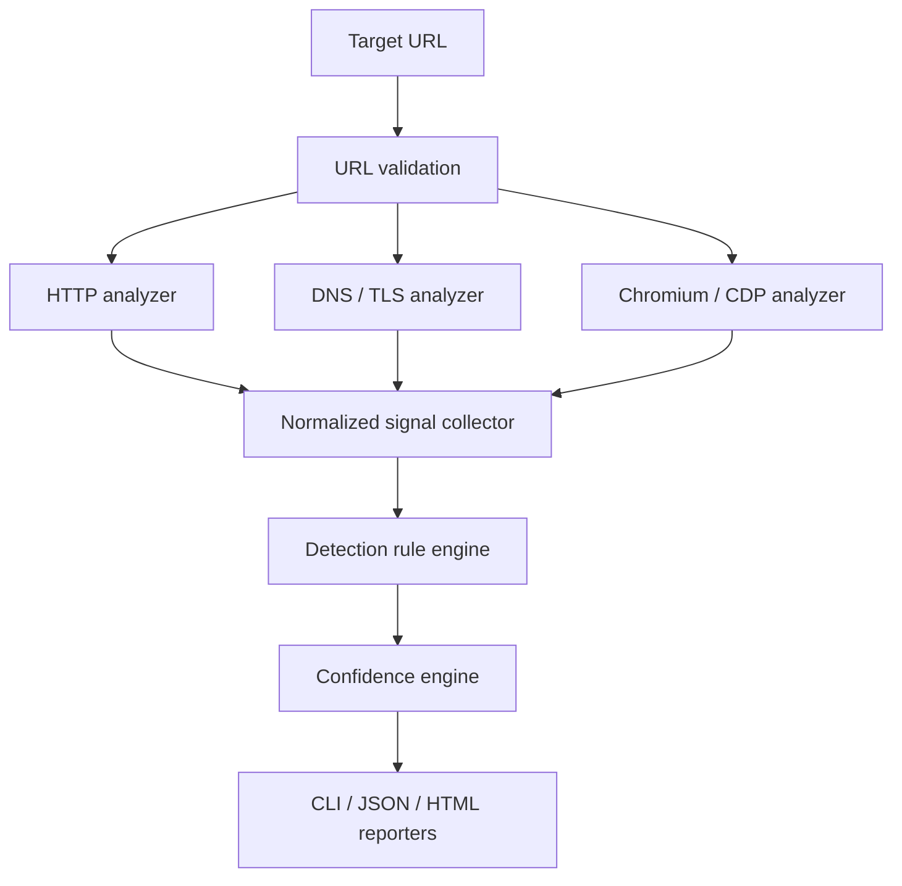

# Planned architecture

## Overview

Hemera separates observation from detection. Protocol- and browser-specific
analyzers collect facts, normalize them as signals, and pass them to a rule
engine. The scoring layer then evaluates the matched, missing, ambiguous, and
conflicting evidence before reporters render the result.



## Components

### URL validation

Validation is a mandatory boundary before every request and after every redirect.
It should accept only HTTP/HTTPS, resolve hosts under controlled rules, reject
loopback/private/link-local/metadata targets, and enforce redirect, response-size,
and time limits. See [Security and ethical boundaries](security-and-ethics.md).

### HTTP analyzer

The low-cost first pass collects status codes, redirect chains, response headers,
cookies, initial HTML, statically visible scripts and iframes, and third-party
hostnames.

### DNS / TLS analyzer

This analyzer may collect CNAME records, relevant provider or ASN hints, and TLS
certificate properties such as issuer and SANs. These are generally supporting
signals and should not independently prove that a precise bot-management product
is active.

### Browser analyzer

A sandboxed Chromium instance observed through the Chrome DevTools Protocol can
collect the final DOM, network requests and responses, XHR/fetch traffic, dynamic
scripts and iframes, JavaScript-created cookies, browser redirects, visible
challenges, and a small set of relevant JavaScript globals. Navigation remains
normal: the analyzer must not implement bypass behavior.

### Signal model

Every analyzer emits the common model implemented in `pkg/model`:

```go
type Signal struct {
	Type       SignalType `json:"type"`
	Source     string     `json:"source"`
	Key        string     `json:"key"`
	Value      string     `json:"value"`
	URL        string     `json:"url,omitempty"`
	Confidence float64    `json:"confidence"`
}
```

Candidate signal types include response headers, cookies, script URLs, network
requests/responses, DOM selectors, iframe URLs, JavaScript globals, DNS records,
TLS properties, redirects, and page content.

`Type`, `Source`, and `Key` are required. `Confidence` is finite and bounded
between 0 and 1; it represents certainty in the observation, not the final
confidence of a product detection. `URL` is optional because some observations
are not URL-scoped. The model exposes `Validate` so producers can enforce these
shared invariants before signals enter the detection pipeline.

The rule engine must depend on this model, not directly on Chromium or
`net/http`. This boundary enables deterministic fixture tests without live scans.

### Detection rules

Rules should be data-driven, using a documented YAML or JSON schema. They need to
express:

- positive and negative signals;
- `AND` and `OR` combinations;
- minimum evidence requirements and weighted signals;
- ambiguity penalties and product conflicts;
- dependencies between related vendor and product detections.

A vendor-level result must not automatically imply a product-level result.

### Confidence engine

The initial model can remain deliberately simple:

```text
score = weighted positive evidence
      - conflicting evidence
      - ambiguity penalty
```

The bounded 0–100 result should be labeled consistently:

| Score | Level | Meaning |
| --- | --- | --- |
| 90–100 | Very High | Several independent, product-specific signals |
| 75–89 | High | Detection is very probable |
| 50–74 | Medium | Meaningful evidence with real ambiguity |
| 25–49 | Low | Weak signals; do not present as certain |
| 0–24 | Not detected | Insufficient evidence |

Bayesian scoring, calibration on a labeled corpus, or learned weights can be
considered later; none is required for the first version.

### Reporting

The CLI report should favor quick interpretation while retaining evidence. JSON
is the automation contract and should be versioned before it is declared stable.
An exportable local HTML report is a later goal.

## Proposed repository layout

```text
cmd/hemera/               CLI entry point
internal/scanner/         scan orchestration
internal/httpanalyzer/    HTTP collection
internal/browser/         Chromium/CDP collection
internal/dns/             DNS and TLS collection
internal/signals/         normalization
internal/rules/           rule loading and matching
internal/scoring/         confidence calculation
internal/report/          output renderers
pkg/model/                intentionally public models, if needed
detectors/                data-driven signatures
testdata/                 fixtures, captures, and expected results
docs/                     project and contributor documentation
```

This is a starting boundary map, not a requirement to create empty packages.
Packages should be introduced as working vertical slices need them.
