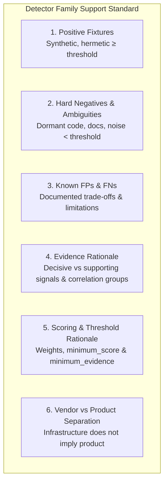

# Detector family support standard

This document defines the mandatory support standard for all detector families
in Hemera. A detector family or rule is considered **supported** only when it
satisfies every requirement defined here and passes the automated enforcement
suite in `internal/detectors`.

## Purpose and principles

Hemera prioritizes **safety, detection accuracy, and explainability** over raw
coverage. A detector must never be added based on casual observation or
unverified heuristics. Every supported rule must be backed by reproducible
synthetic fixtures, clear evidence rationale, justified scoring thresholds, and
an explicit separation between vendor infrastructure and specific security
products.

## The 6 pillars of the support standard

Every supported detector family must fulfill the following six criteria:

### 1. Positive fixtures

- **Hermetic & synthetic:** Every rule must be accompanied by at least one
  synthetic positive test fixture in `internal/scanner/testdata/` (or
  `internal/browser/testdata/` for browser-specific rules). Fixtures must never
  depend on live third-party endpoints, external DNS, or remote CDNs.
- **Decisive verification:** The positive fixture must achieve a detection score
  equal to or exceeding `minimum_score`, produce the expected confidence level
  (e.g., `high` or `very_high`), and match all expected decisive evidence IDs.
- **Multi-source corroboration:** Where a rule supports multiple observation
  channels (HTTP, DNS/TLS, Browser), test fixtures must exercise both
  single-source and multi-source scenarios.

### 2. Hard negatives and ambiguous cases

- **Clean / unrelated pages:** Every rule must be tested against clean pages and
  pages containing unrelated security services to ensure the rule score remains
  0 (`not_detected`).
- **Ambiguous & supporting markers:** Fixtures must include scenarios where only
  supporting evidence is present (e.g., HTML class names or div markers without
  the decisive client script). The resulting score must strictly remain below
  `minimum_score` (`not_detected`).
- **Documentation & code snippet regression:** Fixtures must include pages that
  discuss or quote product markers in plain text or documentation (e.g. blog
  posts or tutorials), verifying that text tokens do not inadvertently trigger
  high-confidence detections.
- **Conflicting products:** Where applicable, ambiguous or competing signatures
  from other vendors must be tested to verify conflict penalties or directional
  disambiguation.

### 3. Known false positives and false negatives

- **Precision over recall:** Hemera explicitly favors low false-positive rates
  over broad recall. It is better to return `not_detected` on an obscured or
  heavily customized integration than to falsely claim a product is active on an
  innocent site.
- **Documented false positives:** Document any edge cases where non-product
  behavior could match rule patterns (e.g., custom reverse proxies reusing
  headers, static documentation sites).
- **Documented false negatives:** Document scenarios where the product is
  present but intentionally not detected (e.g., self-hosted script reverse
  proxies, dynamically loaded scripts rendered only after user interaction
  beyond the post-load window, custom CNAME white-labeling).

### 4. Documented evidence rationale

- **Vendor documentation provenance:** Every signal pattern must trace to
  official vendor documentation, public integration guides, or verified
  technical specifications.
- **Decisive vs. supporting evidence:**
  - **Decisive evidence:** A signal unique and specific enough to prove the
    product's presence (e.g., an official vendor API script URL from a dedicated
    domain). A decisive signal with observation confidence 1.0 reaches the
    `minimum_score` threshold.
  - **Supporting evidence:** A signal that indicates potential integration or
    provides corroboration but is not unique enough on its own (e.g., generic
    CSS class names, inline helper calls, shared CNAMEs, standard response
    headers). Supporting signals have weights below `minimum_score`.
- **Correlation group rationale:** Correlated signals that observe the same
  underlying integration fact from different angles or across multiple
  analyzers (e.g., static HTML script tag vs. browser network request for the
  same script) must share a correlation `group` (e.g., `static_integration`,
  `browser_network`). Within a group, only the maximum contribution is counted,
  preventing duplicate proof of the same fact.

### 5. Documented score and threshold rationale

- **Threshold levels:**
  - `minimum_score: 75` (`high`): Standard threshold for a single decisive
    product integration.
  - `minimum_score: 90` (`very_high`): Reserved for detections requiring
    corroboration across multiple independent evidence groups.
  - `minimum_score: 50` (`medium`): Used for vendor-level infrastructure or
    meaningful evidence with inherent ambiguity.
- **Evidence weights:**
  - Decisive signals: weight &ge; `minimum_score` (typically 75).
  - Supporting signals: weight 15–40 (strictly &lt; `minimum_score`).
  - Ambiguity and negative penalties: subtracted from positive contributions to
    suppress ambiguous or contradicted results.
- **Minimum evidence count:** `minimum_evidence` defines how many distinct
  evidence groups must match. For rules requiring multi-source corroboration,
  `minimum_evidence` must be &ge; 2.

### 6. Explicit vendor-level versus product-level separation

- **Vendor &ne; Product:** Infrastructure observations (such as `Server:
  cloudflare`, `Server: awselb`, CNAME to `.edgekey.net`, or vendor TLS
  certificates) prove only that a CDN, reverse proxy, or cloud hosting provider
  is present. They **never** prove that a specific WAF, Bot Management, or
  CAPTCHA product is active.
- **Rule categorization:**
  - Vendor-level infrastructure rules belong to `cdn_reverse_proxy` or
    `third_party_security` and have an empty `product` field.
  - Product-specific rules belong to `captcha_challenge`, `waf`, `bot_management`,
    or `client_fingerprinting` and must declare the specific `product` name.
- **Dependencies (`requires`):** Product rules that only function behind a
  specific vendor's infrastructure may declare a formal dependency on the
  vendor rule using `requires: ["<vendor>.<infrastructure>"]`. However, the
  product rule must still require its own product-specific positive evidence.

---

## Supported detector families

The following detector families currently meet the support standard:

### 1. Cloudflare Reverse Proxy (`cloudflare.proxy`)

- **Category:** `cdn_reverse_proxy`
- **Vendor:** `Cloudflare`
- **Product:** (Vendor-level infrastructure)
- **Rule ID:** `cloudflare.proxy`

#### Evidence rationale

| Evidence ID | Group | Type | Pattern | Weight | Role | Rationale |
| --- | --- | --- | --- | --- | --- | --- |
| `cloudflare-server-header` | `response_headers` | `response_header` | `Server: cloudflare` | 75 | Decisive | Standard Cloudflare edge proxy server banner. |
| `cloudflare-ray-header` | `response_headers` | `response_header` | `cf-ray` | 75 | Decisive | Unique Ray ID assigned by Cloudflare edge for request tracking. |
| `cloudflare-cache-header` | `response_headers` | `response_header` | `cf-cache-status` | 35 | Supporting | Edge caching diagnostic header. |
| `cloudflare-cname` | `dns` | `dns_record` | `cname` suffix `.cloudflare.net` or `.cdn.cloudflare.net` | 30 | Supporting | Canonical DNS edge routing record. |
| `cloudflare-cert-issuer` | `tls` | `tls_property` | `certificate_issuer` contains `Cloudflare` | 20 | Supporting | Universal SSL certificate issuer. |
| `cloudflare-clearance-cookie` | `cookies` | `cookie` | `cf_clearance` | 25 | Supporting | Edge clearance cookie. |

#### Scoring and threshold rationale

- `minimum_score`: 75 (`high`).
- `minimum_evidence`: 1 group.
- Either decisive header (`Server: cloudflare` or `cf-ray`) independently reaches 75 points.
- Supporting DNS/TLS and caching signals provide corroboration if headers are stripped.
- All response headers share the `response_headers` group so their contribution is `max(75, 75, 35) = 75`.

#### Vendor vs. product separation

- Detection of Cloudflare Reverse Proxy indicates edge infrastructure routing only. It does **not** imply that Cloudflare WAF, Cloudflare Bot Management, or Cloudflare Turnstile is active.

#### Fixture coverage

- **Positive:** `cloudflare-proxy-positive.html` &mdash; returns `Server: cloudflare` and `cf-ray` (`score: 75`, `level: high`, `detected: true`).
- **Hard negative:** `negative.html` &mdash; clean page (`score: 0`, `detected: false`).
- **Ambiguous / clean:** `ambiguous-markers.html` &mdash; (`score: 0`, `detected: false`).

#### Known false positives and false negatives

- **Known false positives:** Custom reverse proxies mirroring `Server: cloudflare` or proxying through Cloudflare without edge termination.
- **Known false negatives:** Complete white-labeling stripping `Server` and `cf-ray` headers on custom enterprise plans.

---

### 2. Cloudflare WAF (`cloudflare.waf`)

- **Category:** `waf`
- **Vendor:** `Cloudflare`
- **Product:** `WAF`
- **Rule ID:** `cloudflare.waf`

#### Evidence rationale

| Evidence ID | Group | Type | Pattern | Weight | Role | Rationale |
| --- | --- | --- | --- | --- | --- | --- |
| `cloudflare-waf-mitigated-header` | `response_headers` | `response_header` | `cf-mitigated: challenge` | 75 | Decisive | Cloudflare WAF mitigation header emitted on challenge responses. |
| `cloudflare-waf-error-header` | `response_headers` | `response_header` | `cf-error-code` | 75 | Decisive | Security error code header emitted on WAF blocks (e.g. 1020, 1015). |
| `cloudflare-waf-block-page` | `static_integration` | `page_content` | `Attention Required! \| Cloudflare` or `cf-error-details` | 75 | Decisive | Standard Cloudflare WAF block and challenge page HTML structure. |
| `cloudflare-waf-challenge-script` | `static_integration` | `script_url` | `/cdn-cgi/challenge-platform/h/[a-z]/orchestrate/chl_page/v1` | 75 | Decisive | Managed challenge orchestration script URL. |

#### Scoring and threshold rationale

- `minimum_score`: 75 (`high`).
- `minimum_evidence`: 1 group.
- Mitigation headers or block page content reach 75 points (`high`).

#### Vendor vs. product separation

- Detection of Cloudflare WAF requires explicit WAF mitigation headers or block/challenge page DOM markers. `cloudflare.proxy` alone never triggers `cloudflare.waf`.

#### Fixture coverage

- **Positive:** `cloudflare-waf-challenge.html` &mdash; 403 status with `cf-mitigated: challenge` and WAF block page DOM (`score: 75`, `level: high`, `detected: true`).
- **Hard negative:** `cloudflare-proxy-positive.html` &mdash; normal proxied page without WAF challenge (`score: 0`, `detected: false`).

#### Known false positives and false negatives

- **Known false positives:** Documentation pages quoting Cloudflare block page HTML verbatim without 403 status.
- **Known false negatives:** Silent WAF rules configured to allow or log traffic without active mitigation or challenge.

---

### 3. Cloudflare Bot Management (`cloudflare.bot_management`)

- **Category:** `bot_management`
- **Vendor:** `Cloudflare`
- **Product:** `Bot Management`
- **Rule ID:** `cloudflare.bot_management`

#### Evidence rationale

| Evidence ID | Group | Type | Pattern | Weight | Role | Rationale |
| --- | --- | --- | --- | --- | --- | --- |
| `cloudflare-bot-telemetry-script` | `static_integration` | `script_url` | `/cdn-cgi/challenge-platform/scripts/jsd/main.js` or `invisible.js` | 75 | Decisive | JavaScript Detections (JSD) telemetry script injected by Bot Management/Bot Fight Mode. |
| `cloudflare-bot-cookie` | `cookies` | `cookie` | `__cf_bm` | 40 | Supporting | Bot score tracking cookie set on requests. |

#### Scoring and threshold rationale

- `minimum_score`: 75 (`high`).
- `minimum_evidence`: 1 group.
- `requires`: `["cloudflare.proxy"]` &mdash; Bot Management operates on Cloudflare proxy infrastructure.
- The JSD telemetry script provides 75 points (`high`).
- The `__cf_bm` cookie alone provides 40 points (`low`), resulting in `not_detected` without telemetry script.

#### Vendor vs. product separation

- Requires both `cloudflare.proxy` presence and specific Bot Management telemetry evidence. A standard Cloudflare proxy setup without Bot Management JS does not detect `cloudflare.bot_management`.

#### Fixture coverage

- **Positive:** `cloudflare-bot-management-positive.html` &mdash; proxied page with `__cf_bm` cookie and `/cdn-cgi/challenge-platform/scripts/jsd/main.js` (`score: 75`, `level: high`, `detected: true`).
- **Hard negative:** `cloudflare-proxy-positive.html` &mdash; proxied page without Bot Management telemetry (`score: 0`, `detected: false`).

#### Known false positives and false negatives

- **Known false positives:** Negligible.
- **Known false negatives:** API endpoints protected by server-side Bot Management without client-side JavaScript injection.

---

### 4. Cloudflare Turnstile (`cloudflare.turnstile`)

- **Category:** `captcha_challenge`
- **Vendor:** `Cloudflare`
- **Product:** `Turnstile`
- **Rule ID:** `cloudflare.turnstile`

#### Evidence rationale

| Evidence ID | Group | Type | Pattern | Weight | Role | Rationale |
| --- | --- | --- | --- | --- | --- | --- |
| `turnstile-client-script` | `static_integration` | `script_url` | `^https://challenges\.cloudflare\.com/turnstile/v0/api\.js` | 75 | Decisive | Documented Cloudflare Turnstile JavaScript API script location ([Cloudflare docs](https://developers.cloudflare.com/turnstile/get-started/client-side-rendering/)). |
| `turnstile-html-marker` | `static_integration` | `page_content` | `cf-turnstile` marker | 30 | Supporting | Standard container class name used for explicit and implicit widget rendering. |

#### Scoring and threshold rationale

- `minimum_score`: 75 (`high`).
- `minimum_evidence`: 1 group.
- The decisive script alone provides 75 points, meeting the `high` threshold.
- The HTML marker provides 30 points (`low`). When present alone, the rule score
  is 30, resulting in `not_detected`.
- Both signals share the `static_integration` correlation group. When both the
  script and HTML marker are present, the group contribution is `max(75, 30) =
  75`, correctly preventing static markup from inflating confidence to
  `very_high`.

#### Vendor vs. product separation

- Detection of Cloudflare Turnstile indicates client-side challenge integration
  only. It does **not** imply that Cloudflare CDN, Cloudflare WAF, or Cloudflare
  Bot Management is active on the origin domain.

#### Fixture coverage

- **Positive:** `turnstile-positive.html` &mdash; contains the official script
  and widget container (`score: 75`, `level: high`, `detected: true`).
- **Hard negative:** `negative.html` &mdash; clean / unrelated page (`score: 0`,
  `detected: false`).
- **Ambiguous marker:** `ambiguous-markers.html` &mdash; contains `cf-turnstile`
  marker without script (`score: 30`, `level: low`, `detected: false`).
- **Documentation regression:** `documentation-regression.html` &mdash; mentions
  Turnstile in text without script (`score: 30`, `level: low`, `detected: false`).

#### Known false positives and false negatives

- **Known false positives:** Negligible. Text discussions without script tags
  only match the supporting marker (score 30 &lt; 75).
- **Known false negatives:** Custom self-hosted proxy scripts that mirror
  `api.js` to a first-party path without referencing
  `challenges.cloudflare.com`.

---

### 5. Google reCAPTCHA (`google.recaptcha`)

- **Category:** `captcha_challenge`
- **Vendor:** `Google`
- **Product:** `reCAPTCHA`
- **Rule ID:** `google.recaptcha`

#### Evidence rationale

| Evidence ID | Group | Type | Pattern | Weight | Role | Rationale |
| --- | --- | --- | --- | --- | --- | --- |
| `recaptcha-client-script` | `static_integration` | `script_url` | `^https://www\.(google\.com\|recaptcha\.net)/recaptcha/(api\|enterprise)\.js` | 75 | Decisive | Documented reCAPTCHA v2, v3, and Enterprise client API script locations ([Google docs](https://developers.google.com/recaptcha/docs/display), [Enterprise docs](https://docs.cloud.google.com/recaptcha/docs/instrument-web-pages)). |
| `recaptcha-html-marker` | `static_integration` | `page_content` | `g-recaptcha` marker | 30 | Supporting | Standard widget container class name for v2/Enterprise widgets. |
| `recaptcha-inline-call` | `static_integration` | `page_content` | `grecaptcha\.(execute\|render)\(` | 35 | Supporting | Client-side JavaScript API invocation pattern. |

#### Scoring and threshold rationale

- `minimum_score`: 75 (`high`).
- `minimum_evidence`: 1 group.
- The decisive script provides 75 points (`high`).
- Supporting markers provide 30 or 35 points (`low`). When present without the
  script, the score remains 30–35, resulting in `not_detected`.
- All three signals share the `static_integration` correlation group. When all
  signals match, the group contribution is `max(75, 30, 35) = 75`, preventing
  markup redundancy from inflating confidence to `very_high`.

#### Vendor vs. product separation

- Detection of Google reCAPTCHA indicates client-side CAPTCHA integration only.
  It does **not** imply that Google Cloud Armor, Google Cloud CDN, or other
  Google infrastructure is protecting the domain.

#### Fixture coverage

- **Positive (Standard):** `recaptcha-positive.html` &mdash; standard
  `google.com/recaptcha/api.js` script with `g-recaptcha` container (`score: 75`,
  `level: high`, `detected: true`).
- **Positive (Enterprise / Alternate Host):**
  `recaptcha-enterprise-regression.html` &mdash; `recaptcha.net/recaptcha/enterprise.js`
  integration (`score: 75`, `level: high`, `detected: true`).
- **Hard negative:** `negative.html` &mdash; clean / unrelated page (`score: 0`,
  `detected: false`).
- **Ambiguous markers:** `ambiguous-markers.html` &mdash; contains `g-recaptcha`
  and inline `grecaptcha.render` without script (`score: 35`, `level: low`,
  `detected: false`).
- **Documentation regression:** `documentation-regression.html` &mdash; mentions
  reCAPTCHA in text without script (`score: 30`, `level: low`, `detected: false`).

#### Known false positives and false negatives

- **Known false positives:** Negligible. Static markers without the official API
  script reach at most score 35.
- **Known false negatives:** Custom self-hosted proxy scripts forwarding
  reCAPTCHA calls; dynamically loaded scripts injected via complex tag managers
  not present in initial HTML.
- **Current limitation:** Does not yet distinguish reCAPTCHA v2, v3, invisible,
  and Enterprise as separate product sub-rules.

---

## Contributor checklist for new detector families

When proposing a new detector family or adding rules to an existing family:

- [ ] **Rule schema compliance:** Valid JSON matching `schema_version: 2` with
  valid categories, regexes, and bounds.
- [ ] **Vendor vs. product separation:** Product rules declare `product` and
  require product-specific evidence; vendor rules do not claim products.
- [ ] **Evidence rationale documented:** Public documentation citations for every
  pattern, clear decisive vs. supporting roles, and justified correlation groups.
- [ ] **Scoring rationale documented:** Justified `minimum_score`, weights, and
  groupings.
- [ ] **Positive fixtures:** At least one hermetic positive fixture in
  `internal/scanner/testdata/` achieving `score >= minimum_score`.
- [ ] **Hard negative fixtures:** Clean page fixture producing `score: 0`.
- [ ] **Ambiguity / supporting-only fixtures:** Supporting markers alone must
  yield `score < minimum_score` and `detected: false`.
- [ ] **False positive / negative analysis:** Known limitations and trade-offs
  documented.
- [ ] **Automated test suite passes:** `go test ./...` and `internal/detectors`
  support standard tests pass without warnings.
